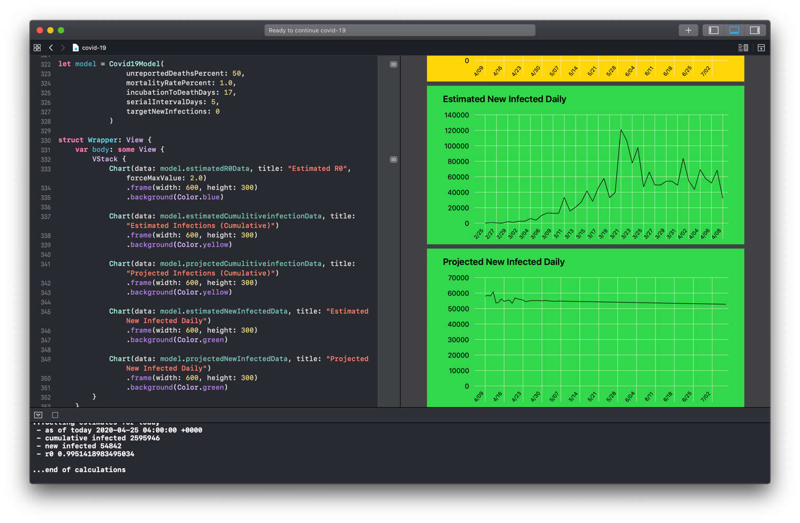
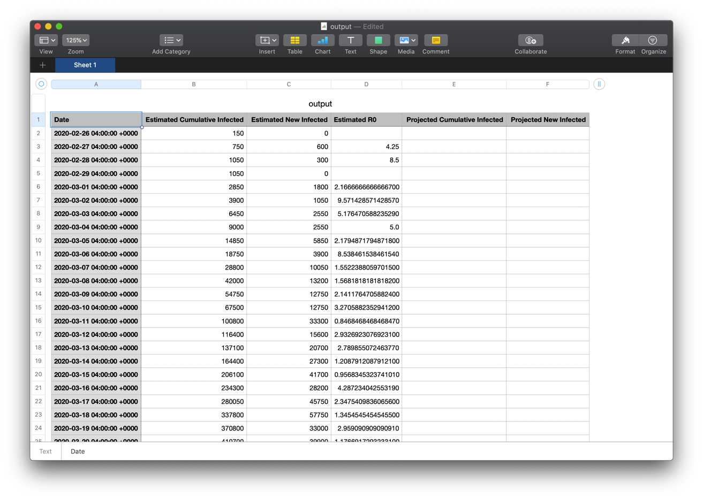

# Covid-19-Playground

This playground is a starting point for modeling Covid-19 cases based on available data on confirmed fatalities due to Covid-19.



## Example usage
````Swift
let model = Covid19Model(
    unreportedDeaths: 50,
    serialInterval: 5,
    incubationPeriod: 4,
    fatalityPeriod: 13,
    fatalityRate: 10,
    projectionTarget: (newCases: 0, days: 90)
)
````  

This creates a dictionary using date as key, and contains the following struct as the value:

````Swift
struct CaseData: Hashable {
    /// Cumulative number of cases estimated by observed deaths and death rate
    let estimatedCumulativeCases: Int?
    
    /// New cases estimated by observed deaths and fatality rate
    let estimatedNewCases: Int?
    
    /// R0 estimated by observed deaths
    let estimatedR0: Double?
    
    /// Cumulative number of cases estimated by using most recent R0 values
    let projectedCumulativeCases: Int?
    
    /// New cases estimated by projected by using most recent R0 values
    let projectedNewCases: Int?
    
    /// R0 estimated by average of recent R0 values
    let projectedR0: Double?
}
````  

## Default values 
The following are used as default values if not provided
- **Unreported Fatalities:** As of 4/24 NYC Department of Health are reporting 10,746 confirmed fatalities and 5,012 probable fatalities. Estmate that unreported fatalities is around 50%. Source: https://www1.nyc.gov/site/doh/covid/covid-19-data.page
- **Serial interval:** Mean estimated as 4 days. Source: https://www.ncbi.nlm.nih.gov/pubmed/32145466
- **Incubation period:** Mean number of days from infection to onset of symptoms 4-5 days. Source: https://www.ncbi.nlm.nih.gov/pubmed/32150748
- **Fatality period:** mean number of days from onset of symptoms to fatality of 13 days. Source: https://www.ncbi.nlm.nih.gov/pubmed/32079150
- **Fatality rate:** There is a much wider spread in estimates for fatality rates - although number of deaths can be reasonabily estimated, without widespread random testing it's hard to confirm how many cases lead to death. Recent random testing of 3,000 cases across NY State suggests that 20% of NYC (~1.68 million) have antibodies suggesting exposure to Covid-19. Combining with 15,758 estimated deaths leads to estimated mortality rate of 0.94% (note this is higer than Cuomo's NY State estimate of 0.5, but he is not including probable deaths. Source: https://www.governor.ny.gov/news/audio-rush-transcript-governor-cuomo-guest-msnbcs-testing-road-reopening-nicolle-wallace

## Example output 
Output is divided into two *estimated* and *projected* values.
Estimated data uses the data on confirmed fatalties from the CSV file and variables set on the model to make estimates for R0, cumulative cases, and new cases for each day.
Estimates are limited from the most recent confirmed number of fatalties, and estimates for incubation and fatality periods.
Projected values use an average from recent R0 values and recent new cases to project values for future cases, either until a threshold for new cases or number of days to project (whichever comes first).

````
...Loading data on confirmed fatalities from data.csv
...Calculating the estimated number of cases based on observed deaths, incubation period, and mortality rate
...Calculating the number of new cases for each date based on serial interval
...End of estimations
...Sorting data by date
...Getting key R0 values
 - Good news! estimated R0 dropped below 1.0 on 2020-03-11 04:00:00 +0000. R0 = 0.8468468468468469 

...Getting lowest estimate for R0 based on estimated cases
 - lowest R0 value on 2020-03-22 04:00:00 +0000. R0 = 0.4594972067039106 

...Getting average R0 from last 7 days
 - Average R0 from last 7 days is 0.9951418983495034
...Getting most recent date with estimated cases
 - Last date with estimated cases is 2020-04-08 04:00:00 +0000. Cumulative cases = 164415.
 - Will now switch to projecting future cases based on most recent R0 value until estimated number of new cases per day drops below 0 

...Projecting future cases based on most recent R0
 - Estimate that new cases will drop to 5274 per day on 2020-07-07 04:00:00 +0000
 - As of this date, estimate that cumulative cases will have reached 653363 

...Getting estimates for today
 - as of today 2020-04-26 04:00:00 +0000
 - cumulative cases 265093
 - new cases 5514
 - r0 0.9951418983495034

...End of projections
...Saving case data to output.csv in your documents folder
````

## Charting
A very bare-bones `ChartView.swift` is included in the sources folder to display estimated and projected values.

````Swift
struct Charts: View {
    var body: some View {
        VStack {
            Chart(data: model.estimatedR0Data, title: "Estimated R0", forceMaxValue: 2.0)
                .frame(width: 600, height: 300)
                .background(Color.blue)

            Chart(data: model.estimatedCumulativeCasesData, title: "Estimated Cumulative Cases")
                .frame(width: 600, height: 300)
                .background(Color.yellow)

            Chart(data: model.projectedCumulativeCasesData, title: "Projected Cumulative Cases")
                .frame(width: 600, height: 300)
                .background(Color.yellow)

            Chart(data: model.estimatedNewCasesData, title: "Estimated New Cases")
                .frame(width: 600, height: 300)
                .background(Color.green)

            Chart(data: model.projectedNewCasesData, title: "Projected New Cases")
                .frame(width: 600, height: 300)
                .background(Color.green)
        }
    }
}

PlaygroundPage.current.setLiveView(Charts())
````

## Output

Running the playground also generates an `output.csv` file in your Documents folder. This contains the results of the model if needed for further post-processing. 


