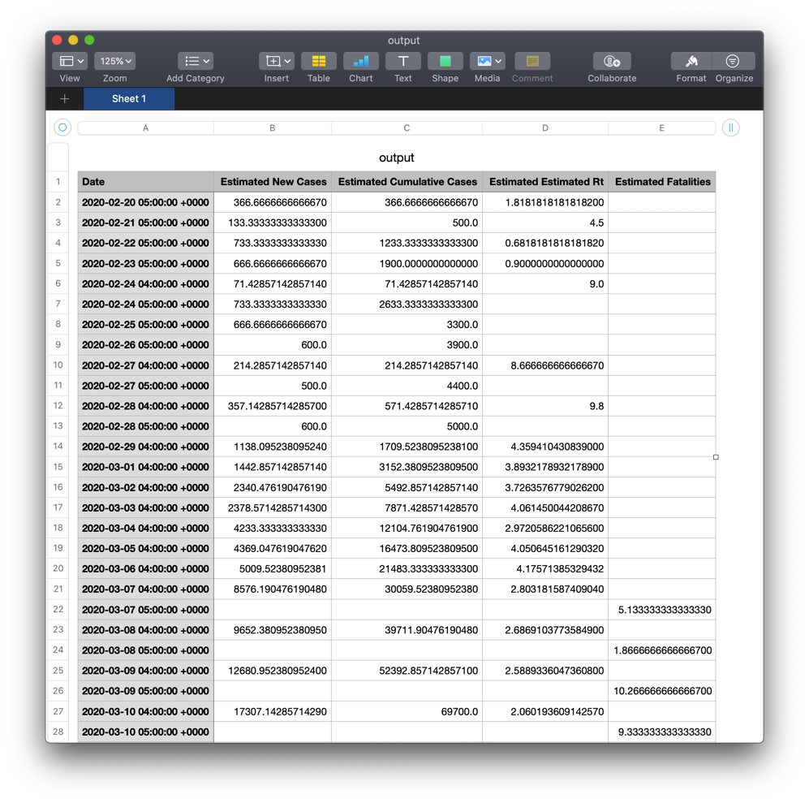

# Covid-19-Playground

This playground is a starting point for modeling Covid-19 cases based on available data on confirmed fatalities and hospitilizations due to Covid-19.

This model is limited in estimating values in the near past, but uses the most recent estimated values for R0 to estimate to the current date and beyond.  

Example:  
* If we have data on confirmed fatalities up to April 30, and we set the incubation period as 5 days, and fatality period as 5 days, then the model will provide estimates on the number of cases up to April 20.
* With a serial interval of 5 days, the model will provide estimates for R0 up to April 15.
* The model will then use an average of recent R0 estimates leading up to April 15 to project values for confimed cases for April 21 and beyond. 


## Usage

The model expects a two csv files in the playground resources folder, one containins with new confirmed and probable deaths for each day, and one containing new hospitilizations each day.
Data from the nychealth repo can be copy and pasted directly from [probable-confirmed-dod.csv](https://github.com/nychealth/coronavirus-data/blob/master/deaths/probable-confirmed-dod.csv) and  [case-hosp-death.csv](https://github.com/nychealth/coronavirus-data/blob/master/case-hosp-death.csv) 

The model can then be created with a range of paramaters to represent the model. 

````Swift
///Create a model with estimates on variables for Covid-19
let model = Covid19Model(
                serialInterval: 5, // mean number of days for infection to a new person
                incubationPeriod: 4, // mean number of days from infection to onset of symptoms
                hospitalizationParamaters: (
                    fileName: "hospitalization-data",
                    dateFormat: "MM/dd/yyyy",
                    inputDrop: 7, // ignore the most recent 7 days of values (NYC DOH seem to take up to 7 days before values for a day are stable)
                    inputMovingAverage: 0,
                    rate: 3.0, // percentage of cases that result in hospitalization
                    period: 7 // mean number of days from onset of symptoms to hospitilization
                ),
                fatalityParamaters: (
                    fileName: "fatality-data",
                    dateFormat: "MM/dd/yyyy",
                    inputDrop: 7, //(NYC DOH seem to take up to 7 days before values for a day are stable)
                    inputMovingAverage: 0,
                    rate: 1.4, // percentage of cases that result in death
                    period: 13 // mean number of days from onset of symptoms to death
                ),
                projectionDays: 51,
                projectionR0Average: 7
            )

````  
The model exposes a number of properties that returns a dictionary with Date keys and value that contains estimated and projected values for each day.  

````Swift
model.r0 // [Date: Double?] estimated R0 for each day
model.newCases: // [Date: Double] estimated new cases for each day
model.cumulativeCases: // [Date: Double] estimated cumulative cases as of each day
model.fatalities: // [Date: Double] estimated new fatalties for each day
````  

## Useful values 

### Unreported Fatalities
As of 4/24 NYC Department of Health are reporting 10,746 confirmed fatalities and 5,012 probable fatalities. Estmate that unreported fatalities is around 50%. This value is only used for days that the input csv does not contain a value for probable deaths.
Source: https://www1.nyc.gov/site/doh/covid/covid-19-data.page

### Serial interval
Mean estimated as 4 days. 
Source: https://www.ncbi.nlm.nih.gov/pubmed/32145466

### Incubation period 
Mean number of days from infection to onset of symptoms 4 days. 
Source: https://www.ncbi.nlm.nih.gov/pubmed/32150748

### Fatality period
Mean number of days from onset of symptoms to fatality of 13 days. 
Source: https://www.ncbi.nlm.nih.gov/pubmed/32079150

### Fatality rate  
There is a much wider spread in estimates for fatality rates - although number of fatalities can be reasonabily estimated, without widespread random testing of the general population it's hard to confirm how many cases lead to death. 

We currently have two studies to draw estimates from: supermarket testing, and first responder testing.

Supermarket testing was performed in the week starting 4/20 when confirmed and probable deaths was 13,683. In this test 20% of NYC supermaket shoppers tested positive for Covid-19 antibodies (source: https://www.governor.ny.gov/news/audio-rush-transcript-governor-cuomo-guest-msnbcs-testing-road-reopening-nicolle-wallace). If this represents wider population of NYC this suggests 1.68 million cases and fatality rate of 0.8%. This group of people is likely biased (for example people who are more strict in their self-isolation may not have been at the supermaket when people were asked to volunteer). Note that Cuomo reported a fatality rate of 0.5% from this study, but did not include probable deaths, and only counted confirmed fatalties from hospitals and nursing homes.

First-responder testing was performed in the week starting 4/27 when confirmed and probable deaths was 16,936. In this test 10-17% of first-responders tested positive for Covid-19 antibodies (source: https://twitter.com/NYGovCuomo/status/1255524216562221057). If this represents wider population of NYC this suggests 0.84 million cases and fatality rate of 2.0%. This group of people is also likely biased (for example first responders may have better access and more consistant use of PPE). 

Taking the average between the two, the default value that the model uses is a fatality rate of 1.4%.


## Example debug output 

Running the model prints progress, errors, and interesting values in the debug output.

````
// default output displays latest R0 estimates 
Average R0 from 7 days ending 04/28/2020
-  0.71

// calling model.printSummary() prints estimates for today
Estimated values for today 05/18/2020
- fatalities: 80
- new hospitalizations: 141
- new cases: 2191
- cumulative cases: 1615009
 
````

## Charting
A very bare-bones `ChartView.swift` is included in the sources folder to display values from the model.
Some extensions are included to help with smoothing charts by applying a moving average.

````Swift
/// display projected new cases for the next 30 days using a 7-day moving average
struct Charts: View {
    var body: some View {
        VStack {
            Chart(data: Array(model.projectedNewCases.movingAverage(period: 7)
                .sorted().filter(isAfterToday)
                    .prefix(30)), title: "Projected New Cases - next 30 days")
              .frame(width: 600, height: 250)
              .background(Color.yellow)
        }
    }
}

PlaygroundPage.current.setLiveView(Charts())
````

## CSV output

Calling the `saveOutput()` function on the model generates an `output.csv` file in your Documents folder. This contains the results of the model if needed for further post-processing. 


